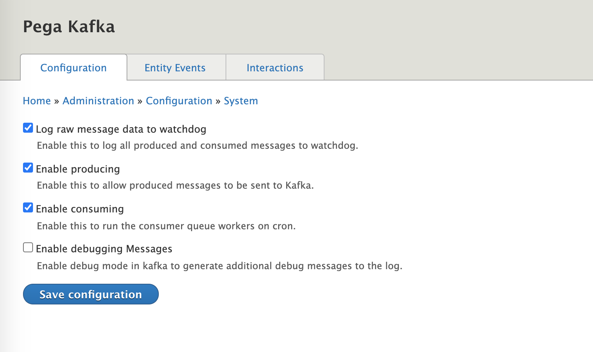

Local Development
------------
### You Probably Don't Need Kafka Set Up Locally:
By default the pega_kafka message is configured to log  produced messages, but not send them to Kafka. Likewise, the default behavior is to not consume any data from Kafka.

As a result, under the default local settings, there is no need to have any connection to Kafka locally. If you are working on an issue where you need to produce data to Kafka, or consume data from Kafka, see the related sections

   * [Producing to Kafka](#producing-to-kafka)
   * [Consuming from Kafka](#consuming-from-kafka)

### But if you do Need Kafka Set Up Locally:
If you want to test end-to-end interactions between system with Kafka locally you will need a Kafka broker to connect to.

#### Setting Up a Local Kafka Broker:
By default, the local environment should be configured to connect to:

```
confluent-kafka.docksal
```
As long as you are following our standard setup (aka using docksal), you can simply checkout the following repository to get started:
```
https://gitlab.com/pegadigital/kaf/confluent-kafka
```
Once the repo is cloned locally, you need only run the standard docksal initialization command:
```
fin init
```
Kafka brokers require a complex orchestration of service transactions to start up so it may take a few minutes after you see the containers start to actually be able to connect to Kafka. If you visit https://confluent-kafka.docksal and see a 500 error, don't worry, the services are still booting. When you see a web administration panel at this URL you will know Kafka is ready.

#### Configuring the Site to Enable Producers / Consumers:
Once you have the confluent Kafka broker running locally you can enable producing and consuming to kafka at **/admin/config/system/pega-kafka**:



Kafka Integration Architecture
------------
The high level interface for interacting with Kafka uses the symfony event_dispatcher system. You can brush up this here: https://www.drupal.org/docs/8/creating-custom-modules/subscribe-to-and-dispatch-events.
### Modules:
   * **pega_kafka**: Implements the Kafka user standards and provides a Symfony Event interface for interacting with Kafka.
   * **pega_kafka_entity_events**: Provides a generic configurable implementation for producing Create and Update entity events.

### You Interact with Kafka Through the event_dispatcher Service:
```
// Produce a message to Kafka.
\Drupal::service('event_dispatcher', KafkaEvent::produce('topic_name'), new KafkaEvent(KafkaMessage::create(...)));
 
 
// Consume a message from Kafka.
class KafkaListener implements EventSubscriberInterface {
 
 
  public function getSubscribedEvents() {
    return [KafkaEvent::consume('topic_name')] => 'onMessage',
  }
 
 
  public function onMessage(KafkaEventInterface $event) {
    $message = $event->getMessage();
    ...
  }
 
 
}

```
See specific sections for more detailed examples:
* [Producing to Kafka](#producing-to-kafka)
* [Consuming from Kafka](#consuming-from-kafka)


### We're using the Kafka Contrib Module:
We are using the [kafka contrib module](https://www.drupal.org/project/kafka) to produce data to Kafka and consume data from Kafka.
This module exposes a queue for every Kafka topic. You produce to Kafka by calling createItem on the queue. You consume from Kafka by creating a QueueWorker for the queue. There are some idiosyncrasies about the way the Kafka contrib modules works that prevent us from using it out-of-the-box:
   1. It is opinionated about the format of data sent to Kafka (it uses php's serialize function on an array). Its opinions are in conflict with the agreed upon standards.
   2. It does not allow us to set the partition key for a topic. This prevents us from guaranteeing correct message ordering based on the data semantics.
   3. It treats the queue name and topic name as equivalent. This can cause issues if:
      1. A topic name in Kafka contains characters that can't appear in the drupal queue id.
      2. A topic name in Kafka collides with a non-kafka drupal queue name.
      3. Since we manage environments by altering the topic name, it would mean client code would need to concern itself with which environment it is operating on.

To address these issues we override the kafka contrib module's queue implementation to address these issues in: **\\Drupal\pega_kafka\Queue\\\* \\**

**NOTE:**
```
As a result of using the contrib module's queue implementation, consuming happens during cron runs.
```
Symfony Events are Mapped to KafkaItem Queue Items:
-------
**\Drupal\pega_kafka\EventSubscriber\KafkaProducerAdapter** listens for KafkaEvent::produce(...) events and uses the kafka contrib module's queue interface to send the data. If you set `enable_producing` to false in the pega_kafka config, this event subscriber will not forward events to the Kafka queue.

**\Drupal\pega_kafka\Plugin\Derivative\PegaKafkaQueueWorker** is used to create derived worker plugins based on \Drupal\pega_kafka\Plugin\QueueWorker\KafkaConsumerAdapter for each configured topic. On cron, each consumer adapter will consume data from the Kafka queue. For each consumed message, a **KafkaEvent::consume(...)** event will be dispatched.

Kafka Messages are Implemented as a DataType Plugin
-------
**\Drupal\pega_kafka\Plugin\DataType\KafkaMessage** represents a piece of data to be sent to Kafka. It is a drupal typed data object that can be serialized by the serializer service. This also allows us to explicitly define the message schema in **\Drupal\pega_kafka\TypedData\KafkaMessageDefinition** and potentially apply data constraints to produced / received messages.

Producing to Kafka
-------
We use the symfony event dispatcher service to send data to Kafka.

```
use Drupal\pega_kafka\Event\KafkaEvent;
use Drupal\pega_kafka\Plugin\DataType\KafkaMessage;
 
$event_dispatcher = \Drupal::service('event_dispatcher');
 
// Create a KafkaMessage to send to the server.
$message = KafkaMessage::create([
  'ActivityType' => 'CustomActivity',
  'ActivityValue' => '100',
]);
 
// Set the entity that is the subject of this event.
$message->setSubjectEntity($node);
 
// Fire away!
$event_dispatcher->dispatch(KafkaEvent::produce('made_up_topic'), new KafkaEvent($message));
```
Consuming from Kafka
--------
Setting up a Kafka consumer is equivilant to creating a symfony event subscriber (see https://www.drupal.org/docs/8/creating-custom-modules/subscribe-to-and-dispatch-events). You can also refer to http://vstash:7990/projects/KAF/repos/pega_kafka/browse/tests/src/Kernel/ConsumerKernelTest.php

**MyKafkaListener.php**
```
<?php
 
namespace Drupal\my_module\EventSubscriber;
 
use Drupal\pega_kafka\Event\KafkaEvent;
use Drupal\pega_kafka\Event\KafkaEventInterface;
use Symfony\Component\EventDispatcher\EventSubscriberInterface;
 
class MyKafkaListener implements EventSubscriberInterface {
 
  /**
   * {@inheritdoc}
   */
  public static function getSubscribedEvents() {
    // call the onMessage callback when we receive a message on 'made_up_topic'.
    return [
      KafkaEvent::consume('entities_metadata') => 'onEntityUpdate',
    ];
  }
 
  /**
   * Callback for message arrival.
   *
   * @param \Drupal\pega_kafka\Event\KafkaEventInterface $event
   *   The kafka event.
   */
  public function onEntityUpdate(KafkaEventInterface $event) {
    $message = $event->getMessage();
 
    echo "entity arrived: \n";
    echo "the id is: " . $message->get('EntityID')->getValue() . "\n";
    echo "the name is " . $message->getCustomProperty('Name') . "\n";
 
    if ($message->get('ActivityType')->getValue() === 'Create')) {
      echo "it's a newly created entity\n";
    }
    else {
      echo "it's an entity update\n";
    }
 
    if ($message->get('EntityType')->getValue() === 'Badge')) {
      echo "it's a badge\n";
    }
  }
 
}
```

**my_module.services.yml**
```
services:
    my_module.kafka_update_listener:
      class: \Drupal\my_module\EventSubscriber\MyKafkaListener
      tags:
        - { name: 'event_subscriber' }
```

### Mocking Consumer Data

You don't need Kafka working locally to test as long as you know what the payload looks like for the message you are building a consumer for. The **\Drupal\pega_kafka\TypedData\KafkaMessageDefinition** implementation lists the top-level properties that are available to read on a Kafka message. You can always safely use the typed data `get` / `getValue` methods to read these properties.

For the `CustomProperties` key, several helper methods are provided as part of **\Drupal\pega_kafka\TypedData\KafkaMessageInterface**. There's no strict schema defined for these properties, so you'll have to examine your sample payload to determine the fields that should be available.  You can retrieve CustomProperties entries by calling the getCustomProperty($key, $default = []) helper method on the message object.

To test your subscriber, we'll follow sample code similar to the code in the [Producing to Kafka](#producing-to-kafka) section, by dispatching a consumer event with a mocked Kafka message.

### Run this code from console, or, ideally part of a phpunit test:
```
use Drupal\my_module\EventSubscriber\MyKafkaListener;
use Drupal\pega_kafka\Event\KafkaEvent;
use Drupal\pega_kafka\Plugin\DataType\KafkaMessage;
 
// The first argument should be the mock data. We should pass 'consume' in the second argument when
// mocking incoming data.
$mock = KafkaMessage::create([
  'ActivityType' => 'Create',
  'EntityType' => 'Badge',
  'EntityID' => 'test',
  'CustomProperties' => [
    'Name' => 'Badge Name',
  ],
], 'consume');
 
// Simulate the message arrival on the entities_metadata topic.
// Note that we are using the KafkaEvent::consume(...) event, _not_ KafkaEvent::produce(...) to test the consumer.
\Drupal::service('event_dispatcher')->dispatch(KafkaEvent::consume('entities_metadata'), new KafkaEvent($mock));
```

### Below settings need to be added for QA/Prod/local environments kafka configuration:
For all environments we need to add below code in **acquia-files/nobackup/secrets.settings.php**
```
$settings['kafka']['consumer']['conf'] = [
 'sasl.mechanisms' => 'PLAIN',
 'security.protocol' => 'SASL_SSL',
 'sasl.username' => '*****',
 'sasl.password' => "*****",
];

$settings['kafka']['producer']['conf'] = [
 'sasl.mechanisms' => 'PLAIN',
 'security.protocol' => 'SASL_SSL',
 'sasl.username' => '*****',
 'sasl.password' => "*****",
];
```

In settings.php we need to add below code.
```
// Base kafka settings.
$settings['kafka'] = [
  'consumer' => [
    'group.id' => 'COC', #specific to project.
  ],
  'producer' => [],
];

// Setup the topics and environment topic identifier for kafka.
$settings['pega_kafka'] = [
  'topics' => [
    'entities_metadata',
    'user_activities',
    'user_management_updates'
  ],
  'env' => '',
];
```
For all environments we need to add below code in **acquia-files/nobackup/secrets.settings.php**
```
$settings['kafka']['consumer']['conf'] = [
 'sasl.mechanisms' => 'PLAIN',
 'security.protocol' => 'SASL_SSL',
 'sasl.username' => '*****', #specific to project
 'sasl.password' => "*****", #specific to project
];

$settings['kafka']['producer']['conf'] = [
 'sasl.mechanisms' => 'PLAIN',
 'security.protocol' => 'SASL_SSL',
 'sasl.username' => '*****', #specific to project 
 'sasl.password' => "*****", #specific to project
];
```
In env.settings.php we need to add below code.
1. For **Prod** environment we need to add below code.
```
// PROD has its own cluster. All other lower environments share the same
// cluster. Auth details in the secrets file.
$settings['kafka']['consumer']['brokers'] = ['pkc-ew2ow.us-east-1.aws.confluent.cloud:9092'];
$settings['kafka']['producer']['brokers'] = ['pkc-ew2ow.us-east-1.aws.confluent.cloud:9092'];
$settings['pega_kafka']['env'] = '';   
```
2. For **QA** Environment we need to add below code.
```
$settings['kafka']['consumer']['brokers'] = ['pkc-ld1ky.us-east-1.aws.confluent.cloud:9092'];
$settings['kafka']['producer']['brokers'] = ['pkc-ld1ky.us-east-1.aws.confluent.cloud:9092'];

$config['search_api.index.predictive']['server'] = 'pega_dev';

// QA and PROD don't include a topic prefix.
if ($_ENV['AH_SITE_ENVIRONMENT'] === 'qa') {
  $settings['pega_kafka']['env'] = '';
}
else {
 $settings['pega_kafka']['env'] = 'dev';
}
```

For local environment we need to add below code in **settings.local.php**.
```
$settings['kafka']['consumer']['brokers'] = ['confluent-kafka.docksal'];
$settings['kafka']['producer']['brokers'] = ['confluent-kafka.docksal'];
$settings['pega_kafka']['env'] = 'dev'; #with this all kakfa messages should be redirected to topic_name.dev
```
